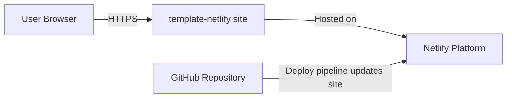
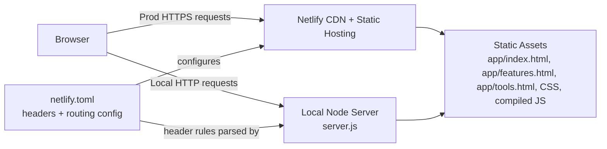

# Architecture

Architecture structure and boundaries overview for this static Netlify app.

Notation: C4 (Context + Container).

## Scope

- Static HTML/CSS/JS pages served in production by Netlify.
- Local development and DAST use `server.js`.
- Security headers are defined in `netlify.toml` and applied both in Netlify and local server behavior.

## C4 – Level 1 (System Context)

## C4 – Level 2 (Container)

## Request Flow (Minimal)

1. Browser requests a page.
2. In production, Netlify serves static files and applies configured headers.
3. In local/dev scanning, `server.js` serves static files and applies header rules parsed from `netlify.toml`.
