# Architecture

Architecture structure and boundaries overview for this static Netlify app.

Notation: C4 (Context + Container).

## Scope

- Static HTML/CSS/JS pages served in production by Netlify.
- Local development and DAST use `server.js`.
- Security headers are defined in `netlify.toml` and applied both in Netlify and local server behavior.

## C4 – Level 1 (System Context)

## C4 – Level 2 (Container)

## Request Flow (Minimal)

1. Browser requests a page.
2. In production, Netlify serves static files and applies configured headers.
3. In local/dev scanning, `server.js` serves static files and applies header rules parsed from `netlify.toml`.

## Development Loops

SlopStopper organises quality feedback into two loops. Together they keep velocity high while keeping quality consistent.

### Inner Loop — Local

The fast, local cycle a developer (or AI agent) runs before pushing code. Completes in seconds to minutes.

```mermaid
flowchart LR
    A["✏️ Write Code\n(with AI)"] -->|build| B["🔨 Build & Lint\nlocally"]
    B -->|verify| C["🧪 Run Tests\nlocally"]
    C -->|commit| D["📤 Push / Open PR"]
    D -.->|iterate on feedback| A
```

### Outer Loop — CI/CD

The automated CI/CD pipeline triggered by every push or pull request. Each stage provides deterministic feedback before code reaches production.

```mermaid
flowchart LR
    PR["📤 Push / Open PR"]
    SC["🔒 Security\nSAST · DAST · Secrets · CVEs"]
    HY["🧹 Hygiene\nComplexity · Docs"]
    RE["✅ Reliability\nE2E · Smoke Tests"]
    DP["🚀 Deploy\nPreview URL"]
    FB["💬 Feedback\nto Developer"]

    PR --> SC
    SC --> HY
    HY --> RE
    RE --> DP
    DP --> FB
    FB -.->|fix & iterate| PR
```

### How the Loops Work Together

| Loop | Where | Speed | Triggered by |
|------|-------|-------|--------------|
| Inner | Local machine | Seconds – minutes | Developer action |
| Outer | GitHub Actions | Minutes | Push or PR |

When the outer loop flags an issue, the developer re-enters the inner loop to fix it. Because the outer loop is **deterministic** — the same checks run the same way every time — developers can trust its feedback and act on it quickly.
