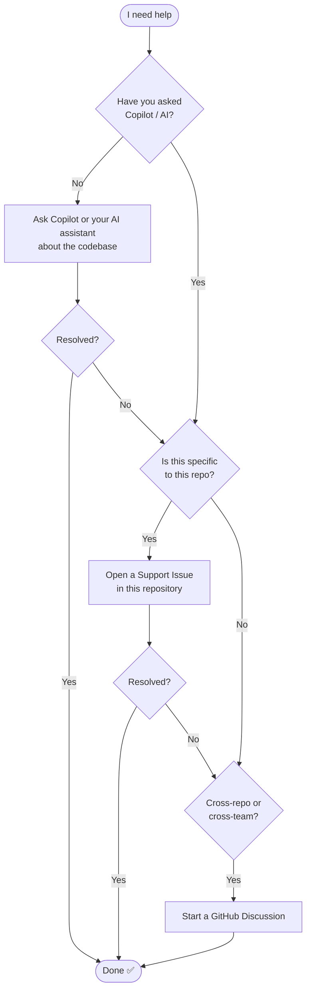

# Support

This document describes how to get help with this project.

## Support Flow

Before raising a support request, please work through the following steps in order. Most questions can be resolved without opening an issue.

## Step 1 — Ask AI First

Use GitHub Copilot or another AI assistant to ask questions about the codebase before raising an issue. This is the fastest path to an answer and keeps the issue tracker focused on genuine bugs or gaps.

**Examples of things AI can help with:**

- "How does the deployment pipeline work?"
- "Where is the configuration for X?"
- "What does this workflow file do?"
- "How do I add a new page to the site?"

## Step 2 — Raise a Support Issue (repo-specific problems)

If AI cannot resolve your question and the problem is **specific to this repository**, open a support issue using the template provided:

👉 [Open a Support Issue](../../issues/new?template=support-request.yml)

Use this for:

- Unexpected behaviour within this repo
- Missing documentation that is clearly scoped to this project
- Configuration questions specific to this template

## Step 3 — Start a Discussion (cross-repo or cross-team)

If the problem spans multiple repositories, teams, or is architectural in nature, start a **GitHub Discussion** rather than an issue:

👉 [Start a Discussion](../../discussions/new)

Use this for:

- Questions that touch multiple repos or teams
- Broad architectural or process questions
- RFCs and proposals that need community input

## Choosing the Right Channel

| Situation | Channel |
|-----------|---------|
| Quick question about the codebase | Ask AI / Copilot |
| Bug or gap scoped to this repo | [Support Issue](../../issues/new?template=support-request.yml) |
| Cross-repo or cross-team concern | [Discussion](../../discussions/new) |
| Security vulnerability | See [Security docs](../security/README.md) |
